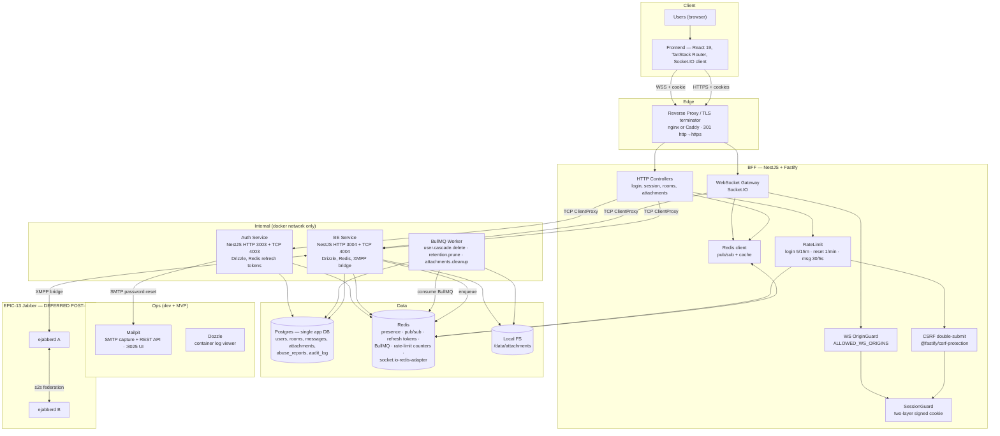
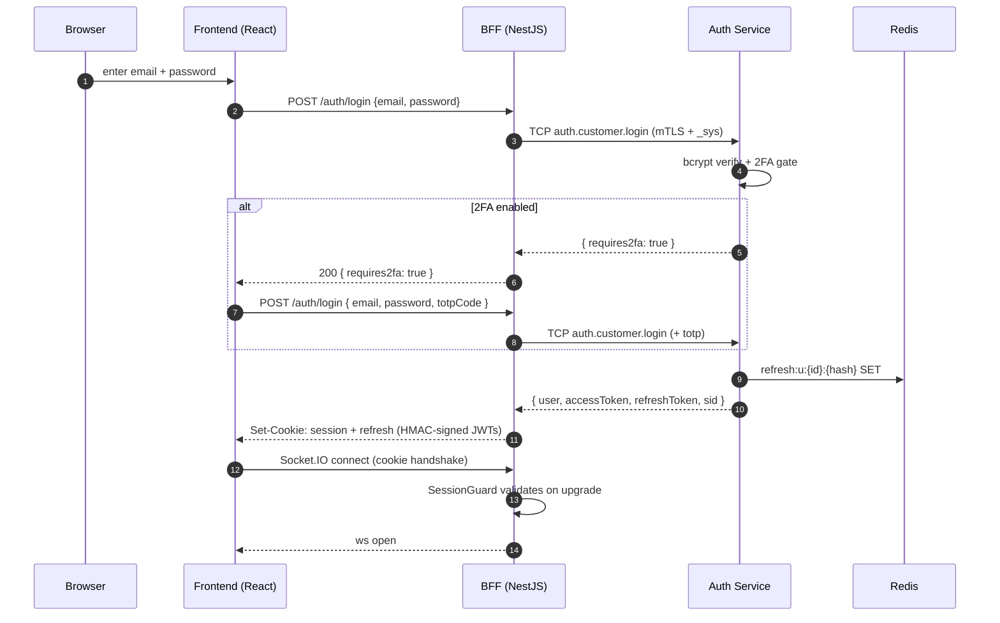
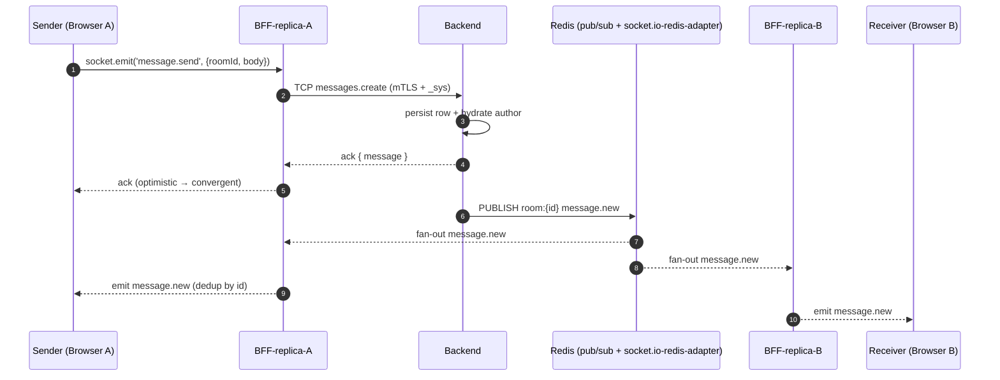
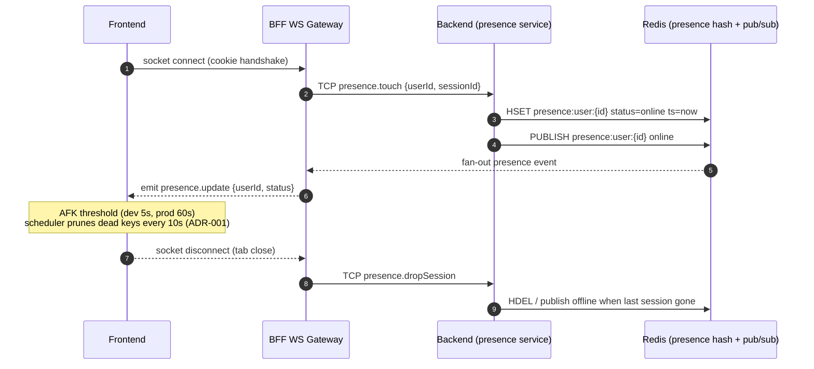

# Architecture — Online Chat Server

High-level system diagram + transport model. Targets: 300 concurrent users, 1000 members/room, 10k-message history, ≤3s message delivery, ≤2s presence propagation.

## Component overview

## Transport choices

| Path | Protocol | Why |
|---|---|---|
| FE ↔ BFF (HTTP) | HTTPS + signed session cookie | Single edge, cookie-based auth, CSRF double-submit |
| FE ↔ BFF (realtime) | Socket.IO (WSS + cookie handshake) | Cookie auth on upgrade (ADR-003) |
| BFF → Auth | NestJS TCP microservice + **mTLS** + `_sys` envelope | Internal RPC, `SystemKeyRpcGuard` rejects forged calls |
| BFF → BE | NestJS TCP microservice + **mTLS** + `_sys` envelope | Same |
| BE → BFF (push) | Redis pub/sub via `@socket.io/redis-adapter` | Fan-out across BFF replicas (ADR-004) |
| BE ↔ XMPP | XMPP (s2s) | EPIC-13 federation — **deferred post-MVP** |

## Auth flow summary

## Real-time flow summary

## Presence flow summary

## Scale model

- BFF horizontal: sticky sessions OR `@socket.io/redis-adapter` for cross-node broadcast
- BE horizontal: stateless; Redis is single source of truth for pub/sub
- Postgres: single primary; indexes `(room_id, created_at DESC)` for messages, cursor pagination
- Files: local FS for MVP (per §3.4). For multi-replica BE, switch to shared volume or S3-compatible store

## Security boundaries

- Only BFF + FE are exposed to the internet. Auth-service + BE listen on `127.0.0.1` (host) or the internal docker network (containers). `TCP_BIND` defaults to `127.0.0.1`; docker-compose overrides to `0.0.0.0`.
- BE never reads `COOKIE_SECRET` or `SESSION_COOKIE_SECRET`.
- Rate limiting + request logging at the BFF edge.
- CSRF double-submit on state-changing REST (`X-CSRF-Token`); WS origin checked at handshake (`ALLOWED_WS_ORIGINS`); Redis sliding-window counters (login 5/15 min, reset 1/min, msg 30/5 s).
- **Two independent defenses on every TCP RPC** (see `app/CLAUDE.md` → Inter-service security):
  1. **`_sys` envelope** — `withSys(payload)` injects `_sys: SYSTEM_KEY`; `SystemKeyRpcGuard` (`APP_GUARD`) rejects mismatches with `RpcException 401`.
  2. **Mutual TLS** — `Transport.TCP` built with `tlsOptions: { ca, cert, key, requestCert: true, rejectUnauthorized: true }`. Certs minted by `app/scripts/gen-certs.sh` into `app/secrets/internal-ca/` (gitignored).
- **Session revocation** — every access JWT carries a `sid` UUID claim bound at mint; `validateToken` probes `sessions.isRevoked(sid)` over TCP on every hit (ADR-007).

## Non-functional targets mapping

| Req | Implementation |
|---|---|
| §3.1 300 users / 1000 per room | Socket.IO + Redis adapter; Postgres indexed tables |
| §3.2 ≤3s deliver / ≤2s presence | WS direct push + Redis pub/sub |
| §3.3 Persistence for years | Postgres + time-partitioned messages (optional) |
| §3.4 Local FS, 20MB/3MB | Fastify multipart + MIME/size validation |
| §3.5 No auto-logout, persistent | Long-TTL refresh cookie + transparent refresh |
| §3.6 Consistency | Server-side permission checks only; BullMQ for async cleanup |
| §5 TLS + CSRF + WS origin + rate-limit | Edge TLS, @fastify/csrf-protection, OriginGuard, Redis sliding-window |
