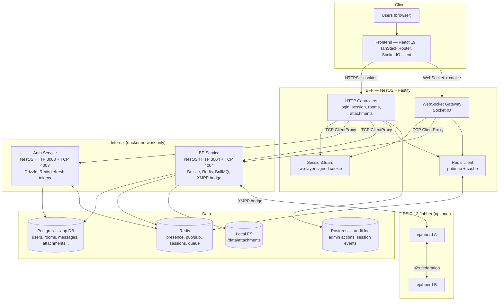

# Architecture — Online Chat Server

High-level system diagram + transport model. Targets: 300 concurrent users, 1000 members/room, 10k-message history, ≤3s message delivery, ≤2s presence propagation.

## Component overview

## Transport choices

| Path | Protocol | Why |
|---|---|---|
| FE ↔ BFF | HTTPS + Socket.IO WebSocket | Single edge, cookie-based auth |
| BFF → Auth | NestJS TCP microservice | Internal RPC, RpcException mapping |
| BFF → BE | NestJS TCP microservice | Internal RPC for commands |
| BE → BFF (push) | Redis pub/sub | Fan-out of real-time events to BFF replicas |
| BE ↔ XMPP | XMPP (s2s) | EPIC-13 federation |

## Auth flow summary

1. FE POST `/auth/login` → BFF → Auth (TCP `auth.customer.login`)
2. Auth returns `{user, accessToken, refreshToken}` OR `{requires2fa:true}`
3. BFF sets two-layer signed cookies (JWT session + refresh)
4. FE opens Socket.IO with `credentials:'include'`; BFF `SessionGuard` validates cookie on WS upgrade

## Real-time flow summary

1. FE `socket.emit('message.send', {roomId, text})`
2. BFF WS handler validates session, calls BE via TCP `messages.create`
3. BE persists, publishes `channel room:{id}` on Redis
4. BFF subscribers for that room receive event → broadcast to Socket.IO clients in room
5. Sender de-duplicates by message id

## Scale model

- BFF horizontal: sticky sessions OR `@socket.io/redis-adapter` for cross-node broadcast
- BE horizontal: stateless; Redis is single source of truth for pub/sub
- Postgres: single primary; indexes `(room_id, created_at DESC)` for messages, cursor pagination
- Files: local FS for MVP (per §3.4). For multi-replica BE, switch to shared volume or S3-compatible store

## Security boundaries

- Only BFF and FE exposed to internet. Auth/BE services listen on docker-internal network only.
- BE never reads `COOKIE_SECRET` or `SESSION_COOKIE_SECRET`.
- Rate limiting + request logging at BFF edge.
- System-to-system calls use `x-system-key` header (existing `SystemKeyGuard`).

## Non-functional targets mapping

| Req | Implementation |
|---|---|
| §3.1 300 users / 1000 per room | Socket.IO + Redis adapter; Postgres indexed tables |
| §3.2 ≤3s deliver / ≤2s presence | WS direct push + Redis pub/sub |
| §3.3 Persistence for years | Postgres + time-partitioned messages (optional) |
| §3.4 Local FS, 20MB/3MB | Fastify multipart + MIME/size validation |
| §3.5 No auto-logout, persistent | Long-TTL refresh cookie + transparent refresh |
| §3.6 Consistency | Server-side permission checks only; BullMQ for async cleanup |
