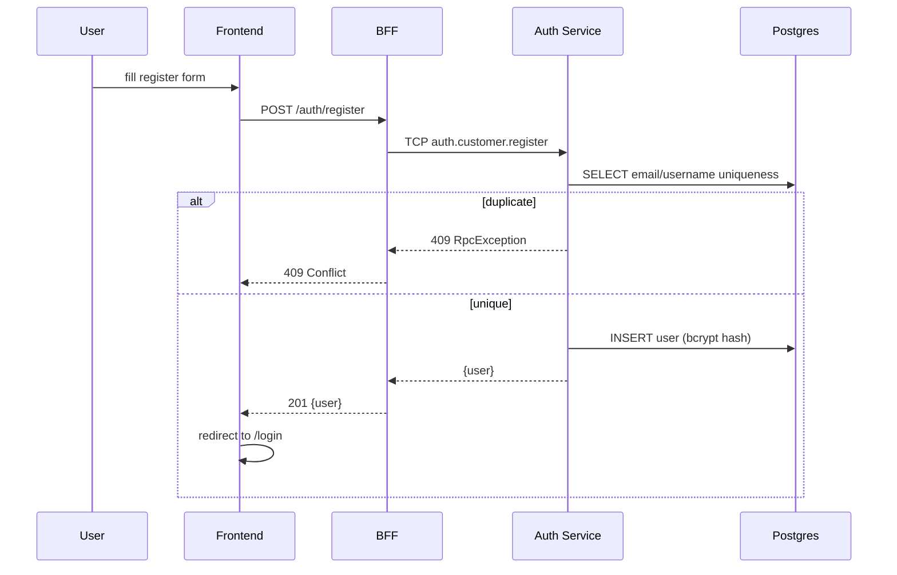

# Flow — EPIC-01 Accounts & Authentication

## Registration



## Login + persistent session

```mermaid
sequenceDiagram
    participant FE
    participant BFF
    participant AUTH
    participant REDIS as Redis
    FE->>BFF: POST /auth/login {email, password}
    BFF->>AUTH: TCP auth.customer.login
    AUTH->>AUTH: bcrypt.compare
    alt requires2fa
        AUTH-->>BFF: {requires2fa:true}
        BFF-->>FE: {requires2fa:true}
        FE->>BFF: POST /auth/login {..., totpCode}
    end
    AUTH->>REDIS: write refresh token
    AUTH-->>BFF: {user, accessToken, refreshToken}
    BFF->>BFF: sign session cookie + refresh cookie
    BFF-->>FE: Set-Cookie: session; refresh
    Note over FE,BFF: Browser reopen → SessionGuard slow-path<br/>uses refresh cookie to renew session
```

## Password reset

```mermaid
sequenceDiagram
    participant FE
    participant BFF
    participant AUTH
    participant DB as Postgres
    participant RL as Redis rate-limit
    participant SMTP as Mailpit/SMTP
    FE->>BFF: POST /auth/password-reset/request {email}
    BFF->>RL: INCR ratelimit:reset:{email} TTL 60s
    BFF->>RL: INCR ratelimit:reset:ip:{ip} TTL 3600s
    alt >1/min email OR >5/hr ip
        BFF-->>FE: 429 {code:RATE_LIMITED, retryAfterMs}
    end
    BFF->>AUTH: TCP passwordReset.request
    AUTH->>DB: INSERT password_resets (hashed token)
    AUTH->>SMTP: send reset email with token link
    AUTH-->>BFF: 204 (generic; no account-existence leak)
    FE->>BFF: POST /auth/password-reset/confirm {token, newPassword}
    BFF->>AUTH: passwordReset.confirm
    AUTH->>DB: UPDATE user.password_hash
    AUTH->>DB: UPDATE password_resets.used_at
    AUTH->>AUTH: revoke all refresh tokens for user
    AUTH-->>FE: 204
```

## Delete account (cascade)

```mermaid
sequenceDiagram
    participant FE
    participant BFF
    participant AUTH
    participant BE as BE Service
    participant Q as BullMQ
    participant W as BullMQ Worker
    participant FS
    FE->>BFF: DELETE /account
    BFF->>AUTH: TCP users.delete
    AUTH->>AUTH: soft-delete user + revoke tokens
    AUTH->>BE: TCP users.delete.cascade {userId}
    BE->>Q: enqueue user.cascade.delete {userId}
    BE-->>AUTH: ack
    AUTH-->>BFF: 204
    BFF-->>FE: clear cookies + 204
    Q->>W: worker: delete owned rooms + msgs + attachments
    BE->>FS: unlink attachment files
    Note over Q: retry w/ exp backoff; >5 attempts → DLQ
```
