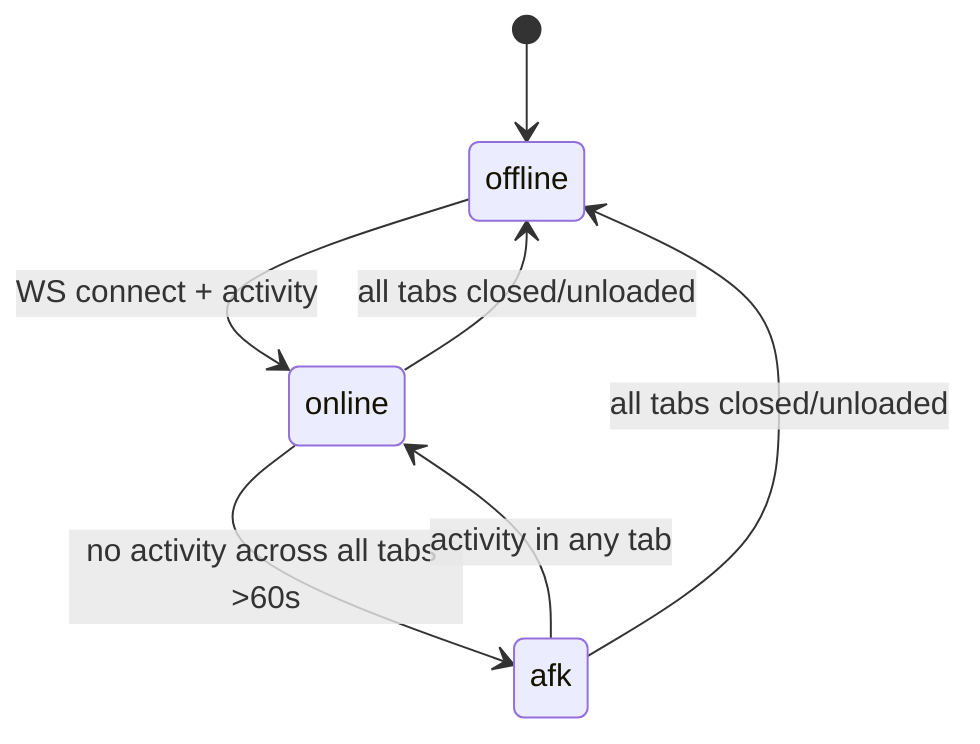
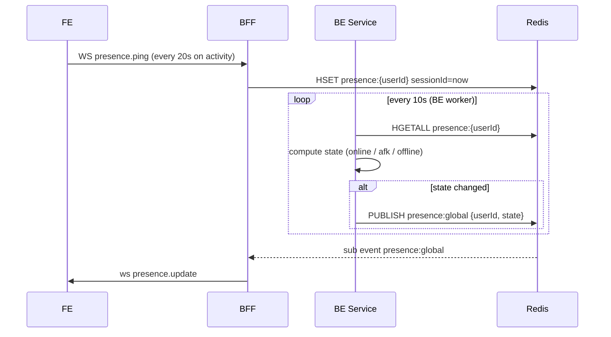
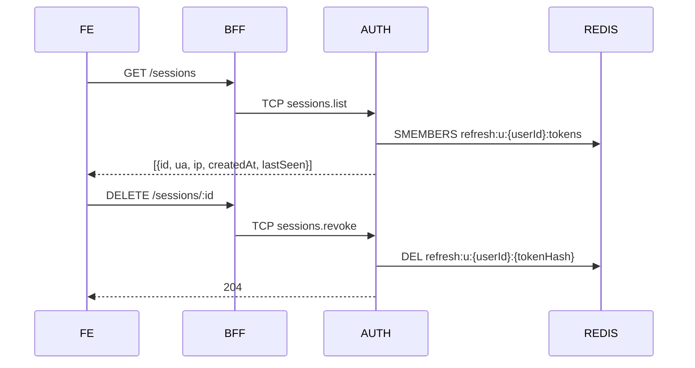

# Flow — EPIC-02 Sessions & Presence

## Presence state derivation

```mermaid
stateDiagram-v2
    [*] --> offline
    offline --> online: WS connect + activity
    online --> afk: no activity across all tabs >60s
    afk --> online: activity in any tab
    online --> offline: all tabs closed/unloaded
    afk --> offline: all tabs closed/unloaded
```

## Heartbeat + AFK evaluation

```mermaid
sequenceDiagram
    participant FE
    participant BFF
    participant BE as BE Service
    participant REDIS as Redis
    FE->>BFF: WS presence.ping (every 20s on activity)
    BFF->>REDIS: HSET presence:{userId} sessionId=now
    loop every 10s (BE worker)
        BE->>REDIS: HGETALL presence:{userId}
        BE->>BE: compute state (online / afk / offline)
        alt state changed
            BE->>REDIS: PUBLISH presence:global {userId, state}
        end
    end
    REDIS-->>BFF: sub event presence:global
    BFF->>FE: ws presence.update
```

## Active sessions screen

```mermaid
sequenceDiagram
    participant FE
    participant BFF
    participant AUTH
    participant REDIS
    FE->>BFF: GET /sessions
    BFF->>AUTH: TCP sessions.list
    AUTH->>REDIS: SMEMBERS refresh:u:{userId}:tokens
    AUTH-->>FE: [{id, ua, ip, createdAt, lastSeen}]
    FE->>BFF: DELETE /sessions/:id
    BFF->>AUTH: TCP sessions.revoke
    AUTH->>REDIS: DEL refresh:u:{userId}:{tokenHash}
    AUTH-->>FE: 204
```
