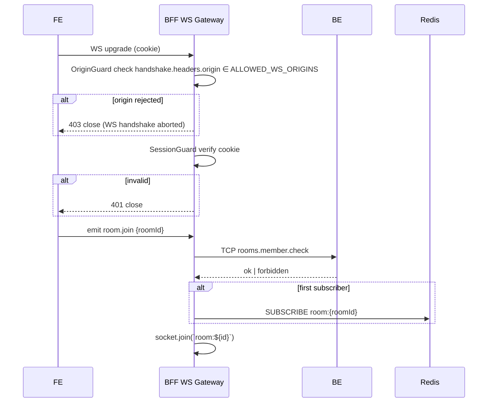
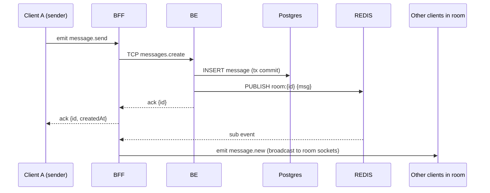
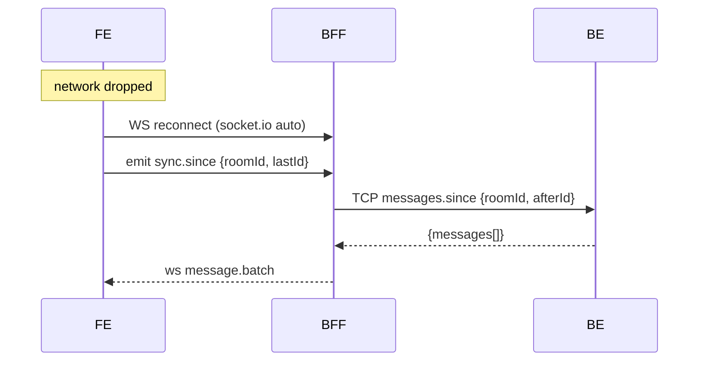

# Flow — EPIC-03 Real-time Transport

## Connection + subscription

```mermaid
sequenceDiagram
    participant FE
    participant BFF as BFF WS Gateway
    participant BE
    participant REDIS as Redis
    FE->>BFF: WS upgrade (cookie)
    BFF->>BFF: OriginGuard check handshake.headers.origin ∈ ALLOWED_WS_ORIGINS
    alt origin rejected
        BFF-->>FE: 403 close (WS handshake aborted)
    end
    BFF->>BFF: SessionGuard verify cookie
    alt invalid
        BFF-->>FE: 401 close
    end
    FE->>BFF: emit room.join {roomId}
    BFF->>BE: TCP rooms.member.check
    BE-->>BFF: ok | forbidden
    alt first subscriber
        BFF->>REDIS: SUBSCRIBE room:{roomId}
    end
    BFF->>BFF: socket.join(`room:${id}`)
```

## Message fan-out

```mermaid
sequenceDiagram
    participant SENDER as Client A (sender)
    participant BFF
    participant BE
    participant DB as Postgres
    participant REDIS
    participant CLIENTS as Other clients in room
    SENDER->>BFF: emit message.send
    BFF->>BE: TCP messages.create
    BE->>DB: INSERT message (tx commit)
    BE->>REDIS: PUBLISH room:{id} {msg}
    BE-->>BFF: ack {id}
    BFF-->>SENDER: ack {id, createdAt}
    REDIS-->>BFF: sub event
    BFF->>CLIENTS: emit message.new (broadcast to room sockets)
```

## Reconnect + missed events

```mermaid
sequenceDiagram
    participant FE
    participant BFF
    participant BE
    Note over FE: network dropped
    FE->>BFF: WS reconnect (socket.io auto)
    FE->>BFF: emit sync.since {roomId, lastId}
    BFF->>BE: TCP messages.since {roomId, afterId}
    BE-->>BFF: {messages[]}
    BFF-->>FE: ws message.batch
```
