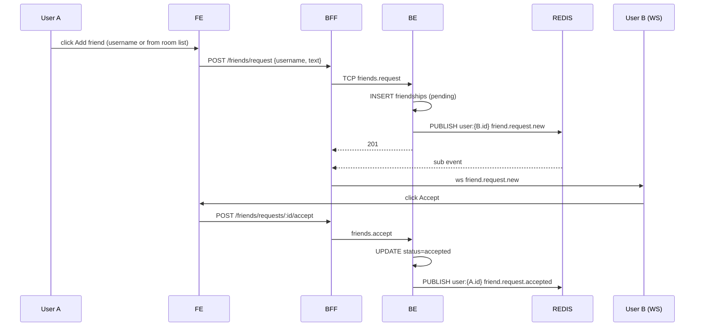
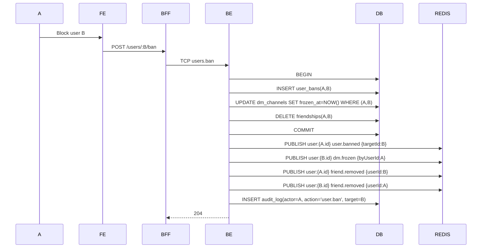
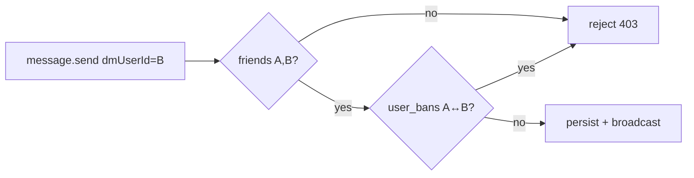

# Flow — EPIC-04 Contacts / Friends / User Bans

## Friend request + confirmation

```mermaid
sequenceDiagram
    participant A as User A
    participant FE
    participant BFF
    participant BE
    participant REDIS
    participant B as User B (WS)
    A->>FE: click Add friend (username or from room list)
    FE->>BFF: POST /friends/request {username, text}
    BFF->>BE: TCP friends.request
    BE->>BE: INSERT friendships (pending)
    BE->>REDIS: PUBLISH user:{B.id} friend.request.new
    BE-->>BFF: 201
    REDIS-->>BFF: sub event
    BFF->>B: ws friend.request.new
    B->>FE: click Accept
    FE->>BFF: POST /friends/requests/:id/accept
    BFF->>BE: friends.accept
    BE->>BE: UPDATE status=accepted
    BE->>REDIS: PUBLISH user:{A.id} friend.request.accepted
```

## User-to-user ban (kills DM + freezes history)

```mermaid
sequenceDiagram
    participant A
    participant FE
    participant BFF
    participant BE
    participant DB
    participant REDIS
    A->>FE: Block user B
    FE->>BFF: POST /users/:B/ban
    BFF->>BE: TCP users.ban
    BE->>DB: BEGIN
    BE->>DB: INSERT user_bans(A,B)
    BE->>DB: UPDATE dm_channels SET frozen_at=NOW() WHERE (A,B)
    BE->>DB: DELETE friendships(A,B)
    BE->>DB: COMMIT
    BE->>REDIS: PUBLISH user:{A.id} user.banned {targetId:B}
    BE->>REDIS: PUBLISH user:{B.id} dm.frozen {byUserId:A}
    BE->>REDIS: PUBLISH user:{A.id} friend.removed {userId:B}
    BE->>REDIS: PUBLISH user:{B.id} friend.removed {userId:A}
    BE->>DB: INSERT audit_log(actor=A, action='user.ban', target=B)
    BE-->>BFF: 204
```

## DM eligibility check (inline on message.send)

```mermaid
flowchart LR
    M[message.send dmUserId=B] --> F{friends A,B?}
    F -- no --> X[reject 403]
    F -- yes --> B{user_bans A↔B?}
    B -- yes --> X
    B -- no --> S[persist + broadcast]
```
