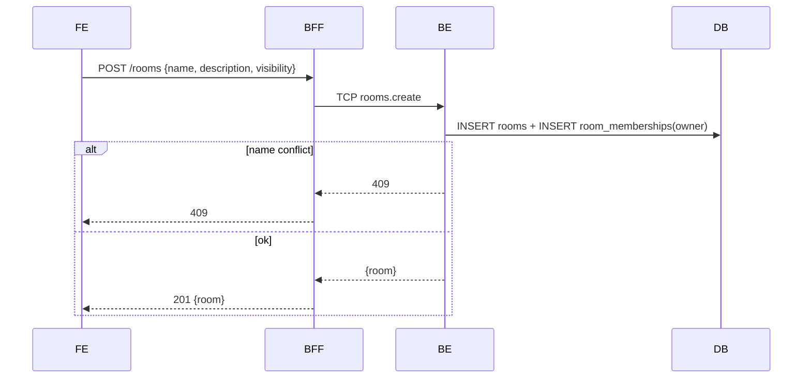
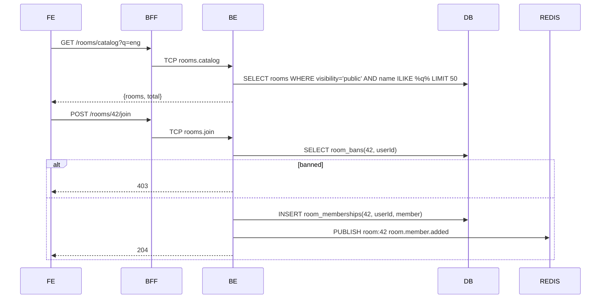
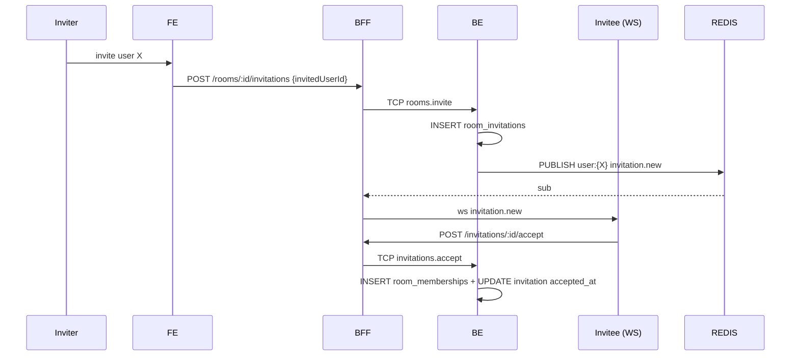
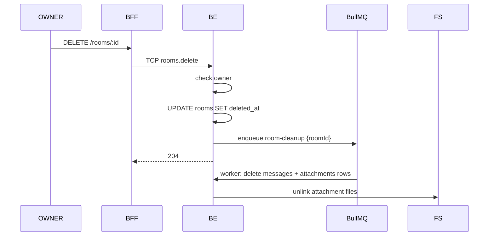

# Flow — EPIC-05 Rooms

## Create room

```mermaid
sequenceDiagram
    participant FE
    participant BFF
    participant BE
    participant DB
    FE->>BFF: POST /rooms {name, description, visibility}
    BFF->>BE: TCP rooms.create
    BE->>DB: INSERT rooms + INSERT room_memberships(owner)
    alt name conflict
        BE-->>BFF: 409
        BFF-->>FE: 409
    else ok
        BE-->>BFF: {room}
        BFF-->>FE: 201 {room}
    end
```

## Public catalog browse + join

```mermaid
sequenceDiagram
    participant FE
    participant BFF
    participant BE
    participant DB
    FE->>BFF: GET /rooms/catalog?q=eng
    BFF->>BE: TCP rooms.catalog
    BE->>DB: SELECT rooms WHERE visibility='public' AND name ILIKE %q% LIMIT 50
    BE-->>FE: {rooms, total}
    FE->>BFF: POST /rooms/42/join
    BFF->>BE: TCP rooms.join
    BE->>DB: SELECT room_bans(42, userId)
    alt banned
        BE-->>FE: 403
    else
        BE->>DB: INSERT room_memberships(42, userId, member)
        BE->>REDIS: PUBLISH room:42 room.member.added
        BE-->>FE: 204
    end
```

## Private invitation

```mermaid
sequenceDiagram
    participant I as Inviter
    participant FE
    participant BFF
    participant BE
    participant INV as Invitee (WS)
    participant REDIS
    I->>FE: invite user X
    FE->>BFF: POST /rooms/:id/invitations {invitedUserId}
    BFF->>BE: TCP rooms.invite
    BE->>BE: INSERT room_invitations
    BE->>REDIS: PUBLISH user:{X} invitation.new
    REDIS-->>BFF: sub
    BFF->>INV: ws invitation.new
    INV->>BFF: POST /invitations/:id/accept
    BFF->>BE: TCP invitations.accept
    BE->>BE: INSERT room_memberships + UPDATE invitation accepted_at
```

## Delete room

```mermaid
sequenceDiagram
    participant OWNER
    participant BFF
    participant BE
    participant Q as BullMQ
    participant FS
    OWNER->>BFF: DELETE /rooms/:id
    BFF->>BE: TCP rooms.delete
    BE->>BE: check owner
    BE->>BE: UPDATE rooms SET deleted_at
    BE->>Q: enqueue room-cleanup {roomId}
    BE-->>BFF: 204
    Q->>BE: worker: delete messages + attachments rows
    BE->>FS: unlink attachment files
```
