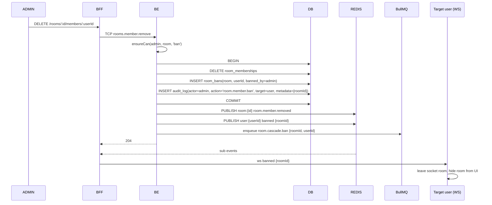
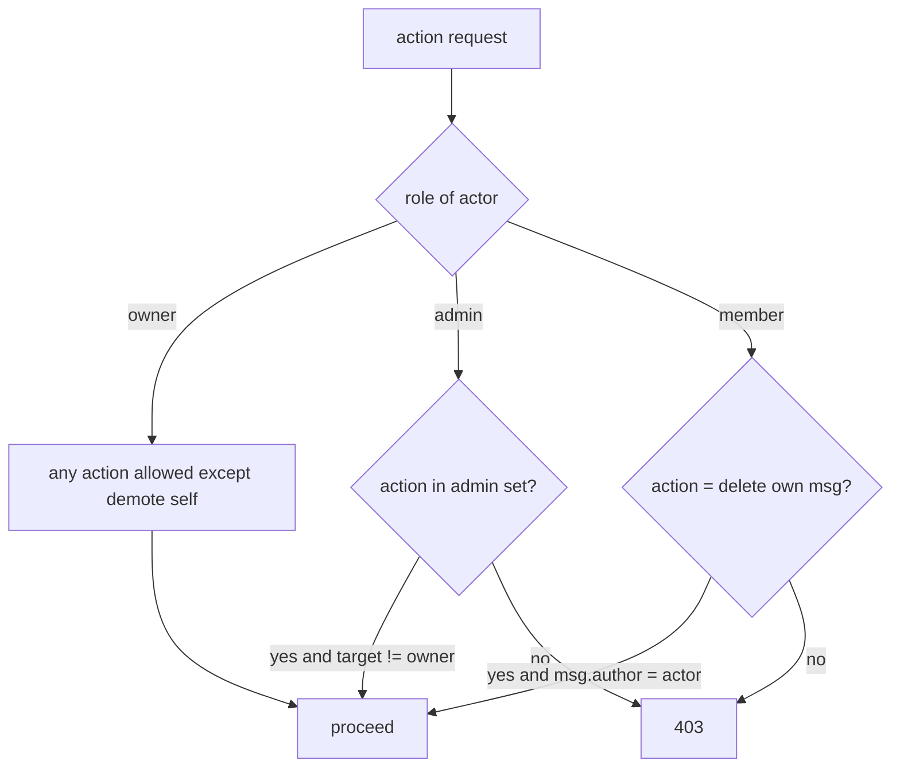
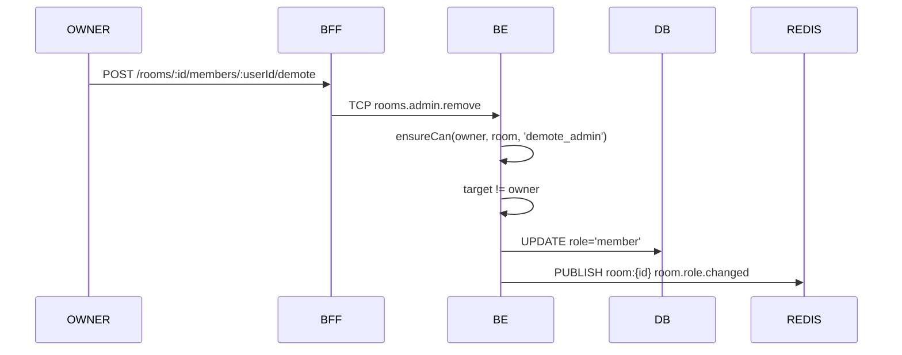
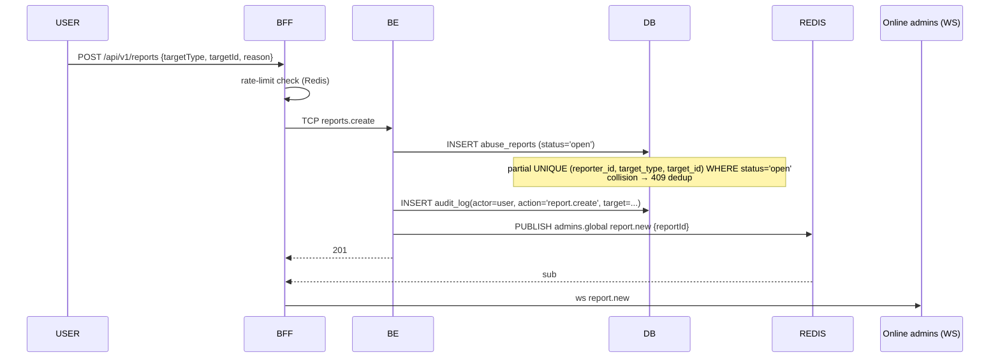

# Flow — EPIC-06 Moderation

## Admin removes (=bans) member



## Permission matrix check



## Owner deletes admin



## Abuse report (user → admin queue)



## Admin resolves report + audit query

```mermaid
sequenceDiagram
    participant ADMIN
    participant BFF
    participant BE
    participant DB
    ADMIN->>BFF: POST /api/v1/admin/reports/:id/resolve
    BFF->>BE: TCP reports.resolve
    BE->>BE: ensureCan(admin, 'report.resolve')
    BE->>DB: UPDATE abuse_reports SET status='resolved', resolved_by, resolved_at
    BE->>DB: INSERT audit_log(actor=admin, action='report.resolve', target=report)
    BE-->>BFF: 204
    ADMIN->>BFF: GET /api/v1/admin/audit-log?actor=&from=&to=
    BFF->>BE: TCP audit.page
    BE->>DB: SELECT ... ORDER BY created_at DESC (keyset)
    BE-->>ADMIN: {entries[], nextCursor}
    Note over DB: audit-write failure is best-effort; never blocks privileged action
```
