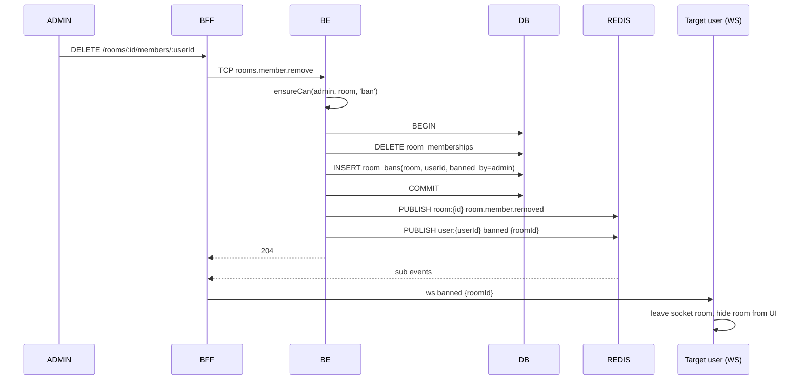
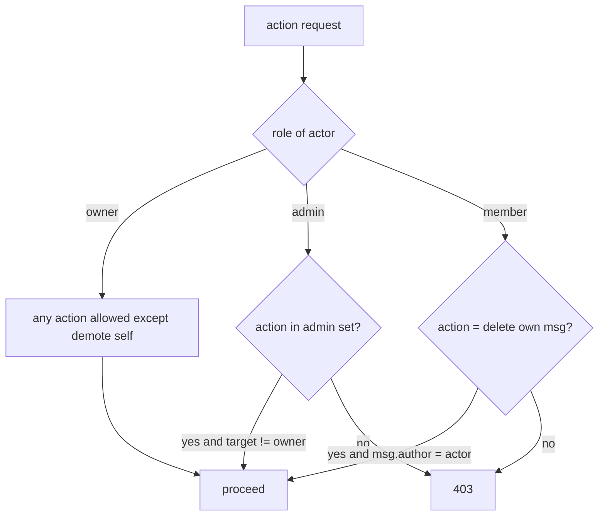
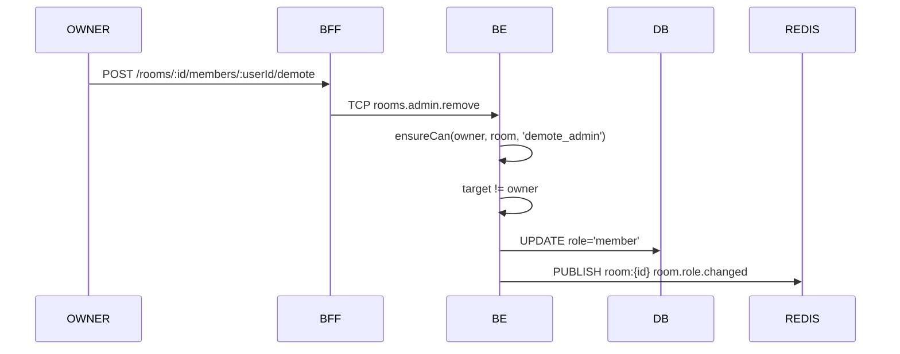

# Flow — EPIC-06 Moderation

## Admin removes (=bans) member

```mermaid
sequenceDiagram
    participant ADMIN
    participant BFF
    participant BE
    participant DB
    participant REDIS
    participant TARGET as Target user (WS)
    ADMIN->>BFF: DELETE /rooms/:id/members/:userId
    BFF->>BE: TCP rooms.member.remove
    BE->>BE: ensureCan(admin, room, 'ban')
    BE->>DB: BEGIN
    BE->>DB: DELETE room_memberships
    BE->>DB: INSERT room_bans(room, userId, banned_by=admin)
    BE->>DB: COMMIT
    BE->>REDIS: PUBLISH room:{id} room.member.removed
    BE->>REDIS: PUBLISH user:{userId} banned {roomId}
    BE-->>BFF: 204
    REDIS-->>BFF: sub events
    BFF->>TARGET: ws banned {roomId}
    TARGET->>TARGET: leave socket room, hide room from UI
```

## Permission matrix check

```mermaid
flowchart TD
    A[action request] --> Q{role of actor}
    Q -->|owner| O[any action allowed except demote self]
    Q -->|admin| AD{action in admin set?}
    Q -->|member| M{action = delete own msg?}
    AD -->|yes and target != owner| OK[proceed]
    AD -->|no| DENY[403]
    M -->|yes and msg.author = actor| OK
    M -->|no| DENY
    O --> OK
```

## Owner deletes admin

```mermaid
sequenceDiagram
    participant OWNER
    participant BFF
    participant BE
    OWNER->>BFF: POST /rooms/:id/members/:userId/demote
    BFF->>BE: TCP rooms.admin.remove
    BE->>BE: ensureCan(owner, room, 'demote_admin')
    BE->>BE: target != owner
    BE->>DB: UPDATE role='member'
    BE->>REDIS: PUBLISH room:{id} room.role.changed
```
