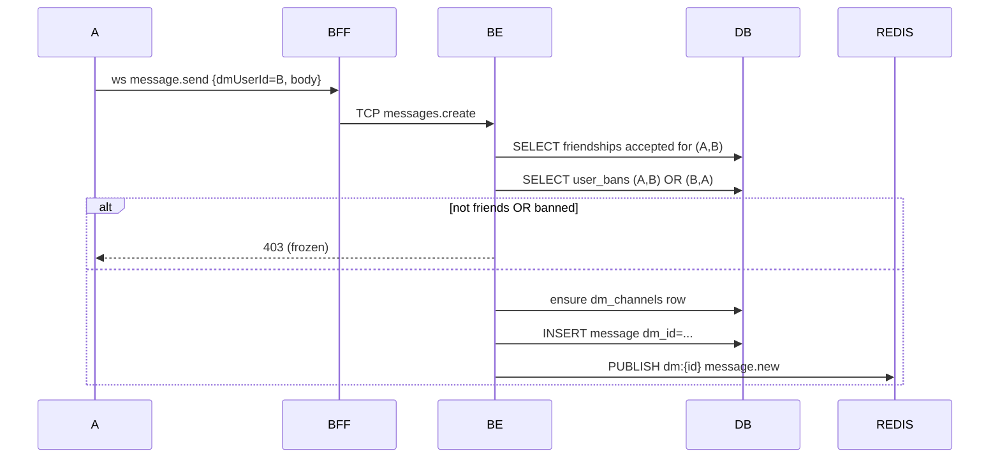
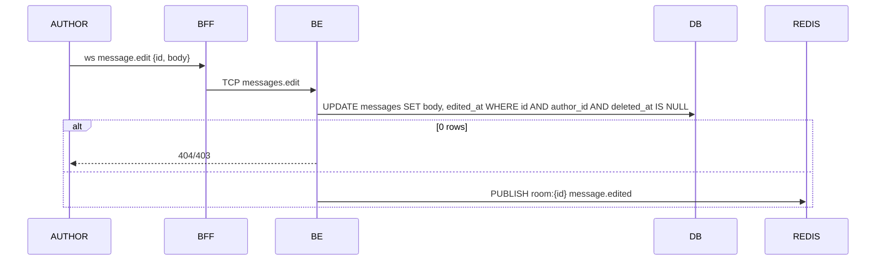
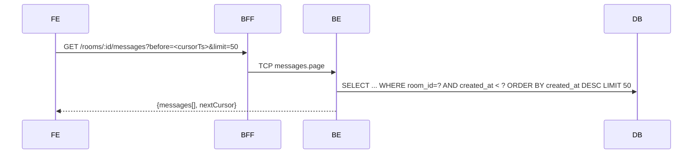

# Flow — EPIC-07 Messaging Core

## Send room message

```mermaid
sequenceDiagram
    participant S as Sender
    participant BFF
    participant RL as Redis sliding-window
    participant BE
    participant DB
    participant REDIS
    participant OTHERS as Other members online
    S->>BFF: ws message.send {roomId, body, replyTo?, attachmentIds?}
    BFF->>RL: ZADD ratelimit:msg:{userId} now; ZREMRANGEBYSCORE <now-5s
    BFF->>RL: ZCARD → count
    alt count > 30 (30 msg / 5s per user)
        BFF-->>S: ws error {code:'RATE_LIMITED', retryAfterMs}
    end
    BFF->>BE: TCP messages.create
    BE->>DB: check membership + not banned
    BE->>DB: INSERT message tx commit
    BE->>REDIS: PUBLISH room:{id} message.new
    BE-->>BFF: {id, createdAt}
    BFF-->>S: ack {id}
    REDIS-->>BFF: sub
    BFF->>OTHERS: ws message.new
```

## Send DM (with friendship + ban check)



## Edit



## Delete (author or room admin)

```mermaid
sequenceDiagram
    participant ACTOR
    participant BFF
    participant BE
    participant DB
    ACTOR->>BFF: ws message.delete {id}
    BFF->>BE: TCP messages.delete
    BE->>DB: fetch message
    BE->>BE: actor = author OR actor has admin role in room
    alt allowed
        BE->>DB: UPDATE deleted_at=NOW()
        BE->>REDIS: PUBLISH room:{id} message.deleted
    else
        BE-->>ACTOR: 403
    end
```

## Infinite scroll (history)


