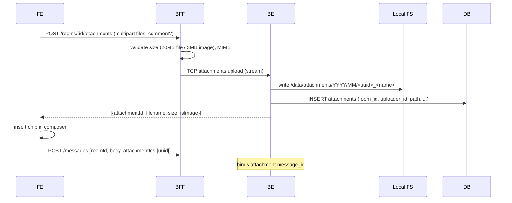
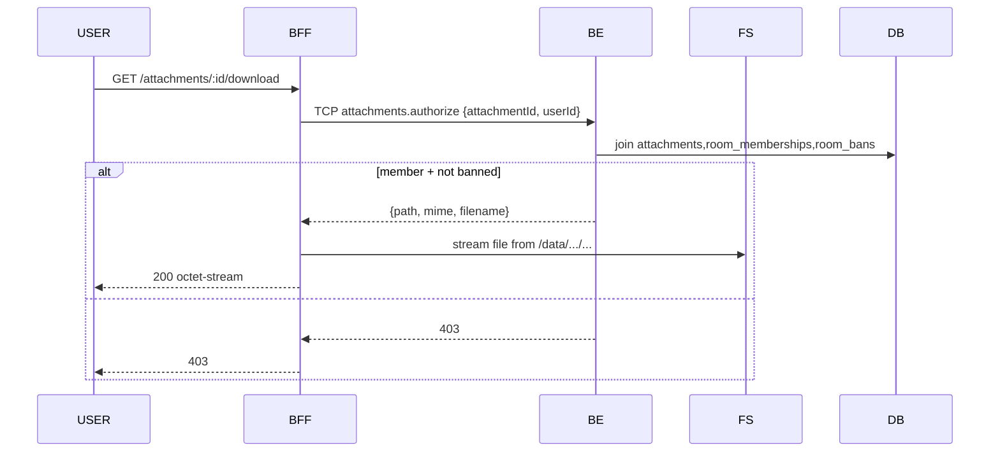
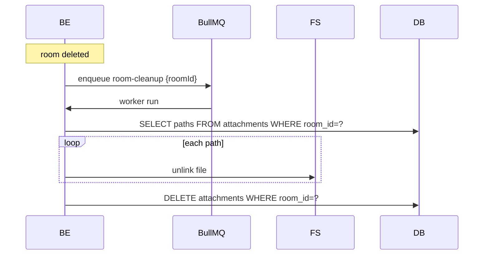

# Flow — EPIC-08 Attachments

## Upload (button or paste) + attach to message

```mermaid
sequenceDiagram
    participant FE
    participant BFF
    participant BE
    participant FS as Local FS
    participant DB
    FE->>BFF: POST /rooms/:id/attachments (multipart files, comment?)
    BFF->>BFF: validate size (20MB file / 3MB image), MIME
    BFF->>BE: TCP attachments.upload (stream)
    BE->>FS: write /data/attachments/YYYY/MM/<uuid>_<name>
    BE->>DB: INSERT attachments (room_id, uploader_id, path, ...)
    BE-->>FE: [{attachmentId, filename, size, isImage}]
    FE->>FE: insert chip in composer
    FE->>BFF: POST /messages {roomId, body, attachmentIds:[uuid]}
    Note over BE: binds attachment.message_id
```

## Download with access control

```mermaid
sequenceDiagram
    participant USER
    participant BFF
    participant BE
    participant FS
    participant DB
    USER->>BFF: GET /attachments/:id/download
    BFF->>BE: TCP attachments.authorize {attachmentId, userId}
    BE->>DB: join attachments,room_memberships,room_bans
    alt member + not banned
        BE-->>BFF: {path, mime, filename}
        BFF->>FS: stream file from /data/.../...
        BFF-->>USER: 200 octet-stream
    else
        BE-->>BFF: 403
        BFF-->>USER: 403
    end
```

## Persistence + cleanup on room delete

```mermaid
sequenceDiagram
    participant BE
    participant Q as BullMQ
    participant FS
    participant DB
    Note over BE: room deleted
    BE->>Q: enqueue room-cleanup {roomId}
    Q->>BE: worker run
    BE->>DB: SELECT paths FROM attachments WHERE room_id=?
    loop each path
        BE->>FS: unlink file
    end
    BE->>DB: DELETE attachments WHERE room_id=?
```
