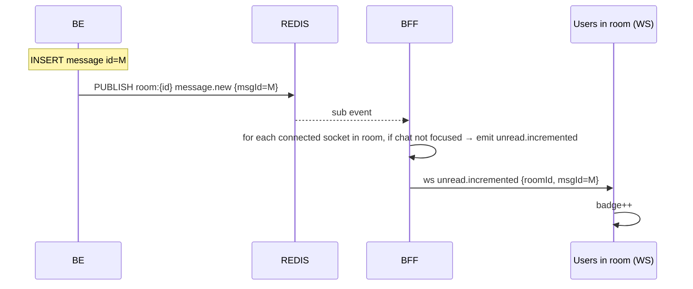
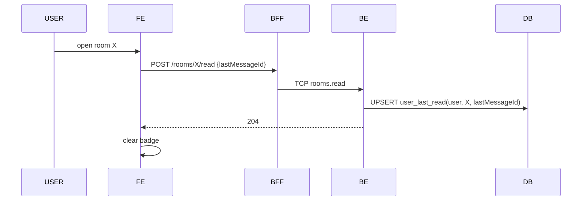
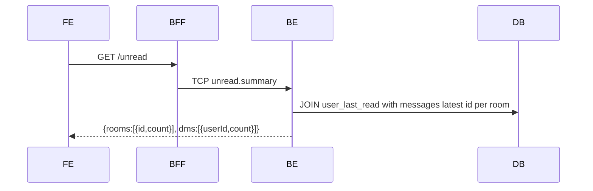

# Flow — EPIC-09 Notifications & Unread

## Unread incremented on new message

```mermaid
sequenceDiagram
    participant BE
    participant REDIS
    participant BFF
    participant USERS as Users in room (WS)
    Note over BE: INSERT message id=M
    BE->>REDIS: PUBLISH room:{id} message.new {msgId=M}
    REDIS-->>BFF: sub event
    BFF->>BFF: for each connected socket in room, if chat not focused → emit unread.incremented
    BFF->>USERS: ws unread.incremented {roomId, msgId=M}
    USERS->>USERS: badge++
```

## Clear on chat open

```mermaid
sequenceDiagram
    participant USER
    participant FE
    participant BFF
    participant BE
    participant DB
    USER->>FE: open room X
    FE->>BFF: POST /rooms/X/read {lastMessageId}
    BFF->>BE: TCP rooms.read
    BE->>DB: UPSERT user_last_read(user, X, lastMessageId)
    BE-->>FE: 204
    FE->>FE: clear badge
```

## Initial load

```mermaid
sequenceDiagram
    participant FE
    participant BFF
    participant BE
    participant DB
    FE->>BFF: GET /unread
    BFF->>BE: TCP unread.summary
    BE->>DB: JOIN user_last_read with messages latest id per room
    BE-->>FE: {rooms:[{id,count}], dms:[{userId,count}]}
```
