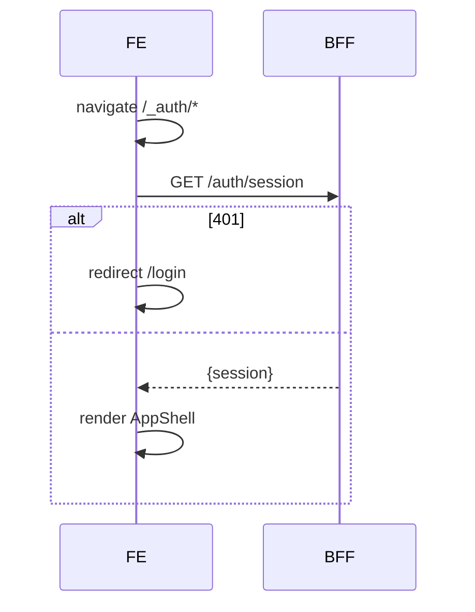
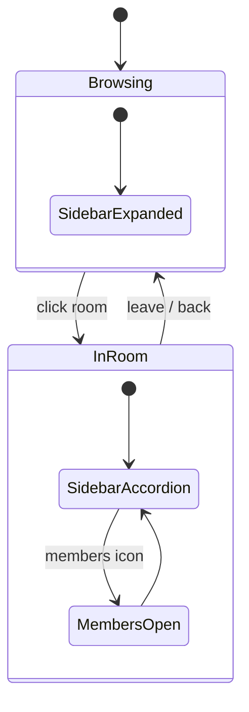
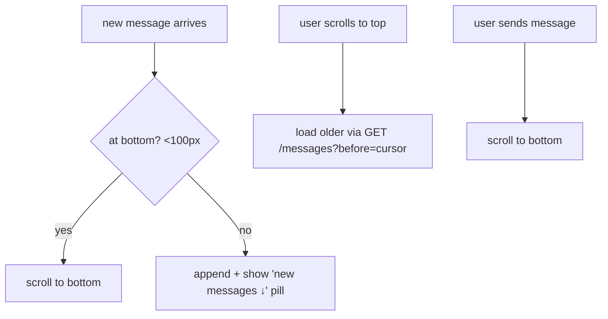
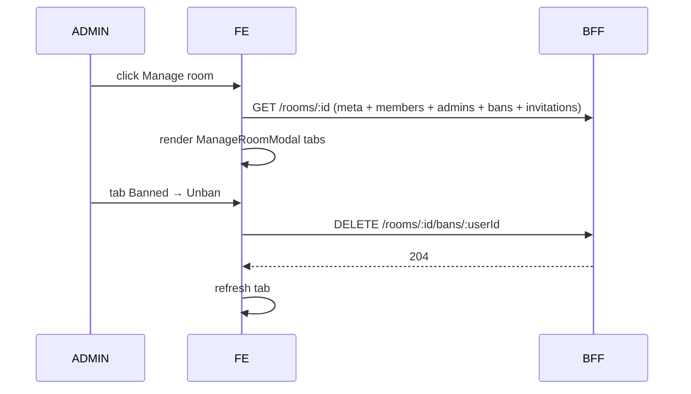

# Flow — EPIC-10 UI Shell & Layout

## Route-level auth guard

```mermaid
sequenceDiagram
    participant FE
    participant BFF
    FE->>FE: navigate /_auth/*
    FE->>BFF: GET /auth/session
    alt 401
        FE->>FE: redirect /login
    else
        BFF-->>FE: {session}
        FE->>FE: render AppShell
    end
```

## Entering a room — layout state

```mermaid
stateDiagram-v2
    [*] --> Browsing
    Browsing --> InRoom: click room
    InRoom --> Browsing: leave / back
    state Browsing {
        [*] --> SidebarExpanded
    }
    state InRoom {
        [*] --> SidebarAccordion
        SidebarAccordion --> MembersOpen: members icon
        MembersOpen --> SidebarAccordion
    }
```

## Chat scroll stickiness

```mermaid
flowchart TD
    NEW[new message arrives] --> AT{at bottom? <100px}
    AT -- yes --> S[scroll to bottom]
    AT -- no --> N[append + show 'new messages ↓' pill]
    USER[user scrolls to top] --> FETCH[load older via GET /messages?before=cursor]
    SEND[user sends message] --> ALWAYS[scroll to bottom]
```

## Admin modal (Manage Room)

```mermaid
sequenceDiagram
    participant ADMIN
    participant FE
    participant BFF
    ADMIN->>FE: click Manage room
    FE->>BFF: GET /rooms/:id (meta + members + admins + bans + invitations)
    FE->>FE: render ManageRoomModal tabs
    ADMIN->>FE: tab Banned → Unban
    FE->>BFF: DELETE /rooms/:id/bans/:userId
    BFF-->>FE: 204
    FE->>FE: refresh tab
```
