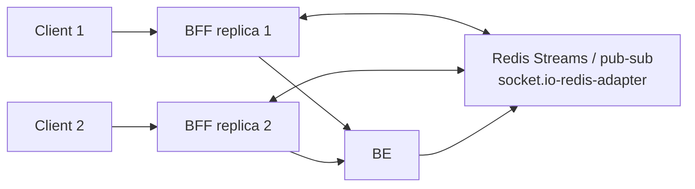
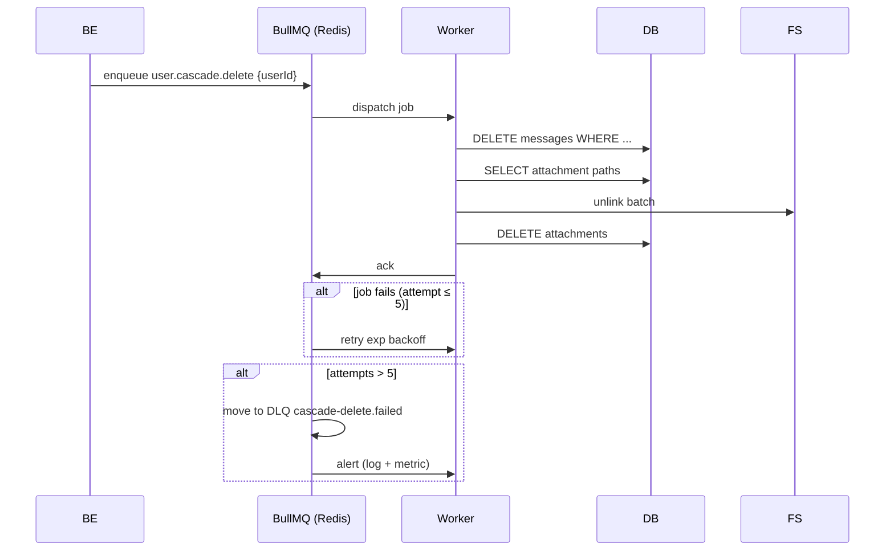
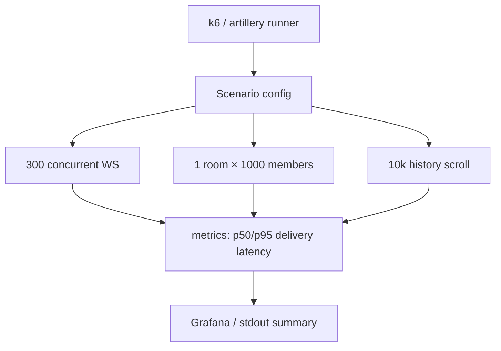
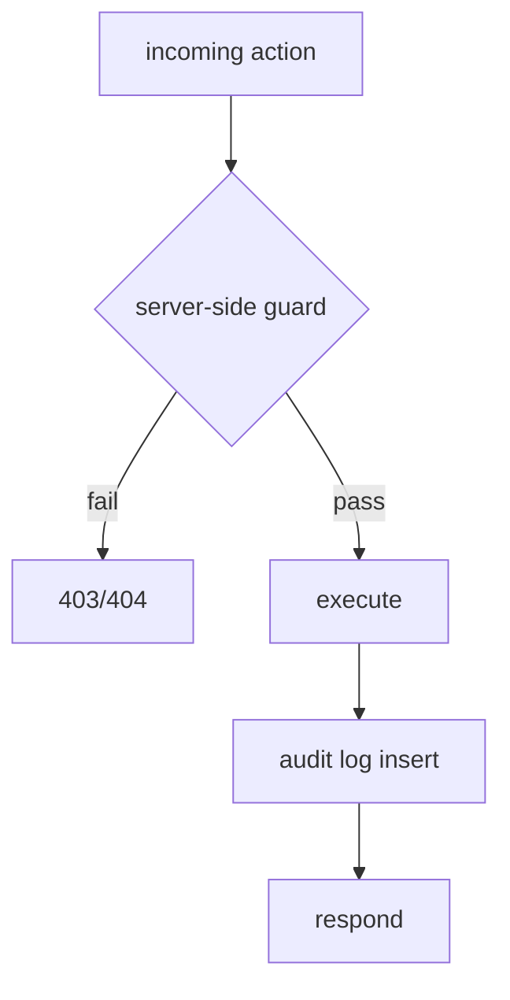
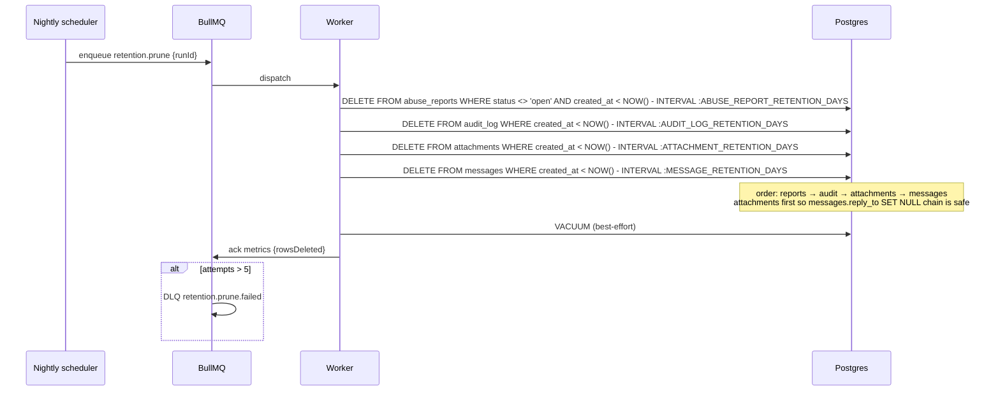

# Flow — EPIC-11 Scale & Reliability

## Horizontal BFF fan-out with Redis adapter

## Async delete-cascade (account or room)

## Load test harness

## Invariant checks (CI + runtime)

## Retention pruning (nightly)

