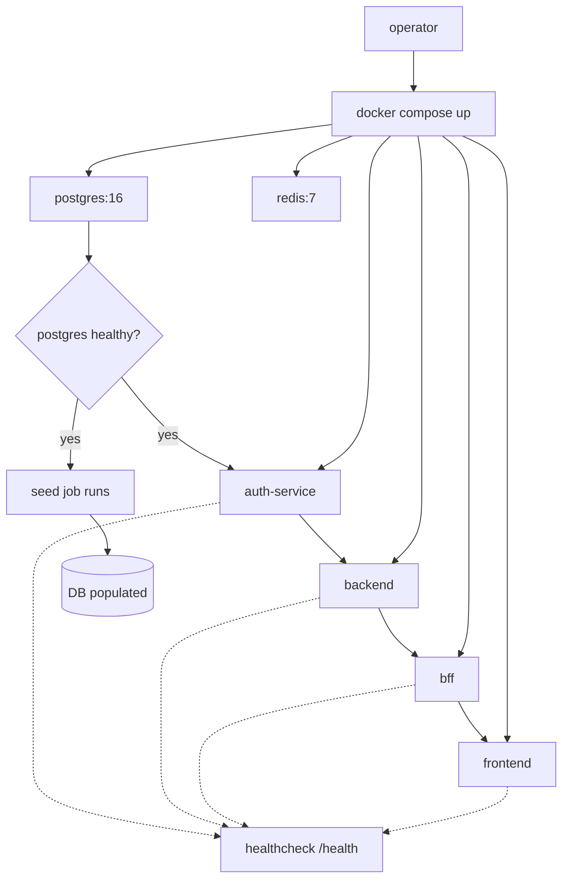
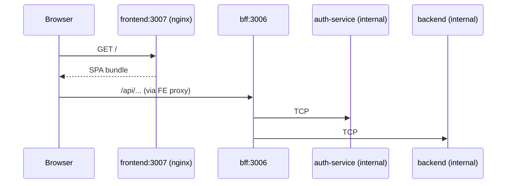
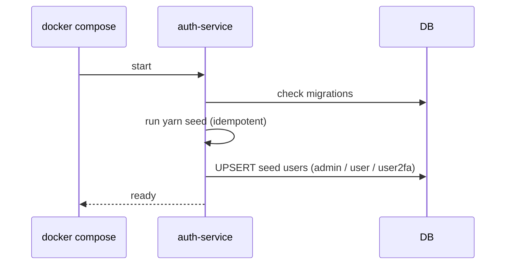

# Flow — EPIC-12 Deployment

## `docker compose up` bootstrap

```mermaid
flowchart TB
    U[operator] --> C[docker compose up]
    C --> PG[postgres:16]
    C --> RD[redis:7]
    C --> AU[auth-service]
    C --> BE[backend]
    C --> BF[bff]
    C --> FE[frontend]
    PG --> HK{postgres healthy?}
    HK -- yes --> SEED[seed job runs]
    SEED --> DB[(DB populated)]
    HK -- yes --> AU
    AU --> BE
    BE --> BF
    BF --> FE
    FE -.-> HC[healthcheck /health]
    BF -.-> HC
    BE -.-> HC
    AU -.-> HC
```

## Request path in prod

```mermaid
sequenceDiagram
    participant USER as Browser
    participant FE as frontend:3007 (nginx)
    participant BFF as bff:3006
    participant AU as auth-service (internal)
    participant BE as backend (internal)
    USER->>FE: GET /
    FE-->>USER: SPA bundle
    USER->>BFF: /api/... (via FE proxy)
    BFF->>AU: TCP
    BFF->>BE: TCP
```

## Seed on first boot

```mermaid
sequenceDiagram
    participant C as docker compose
    participant AU as auth-service
    participant DB
    C->>AU: start
    AU->>DB: check migrations
    AU->>AU: run yarn seed (idempotent)
    AU->>DB: UPSERT seed users (admin / user / user2fa)
    AU-->>C: ready
```
