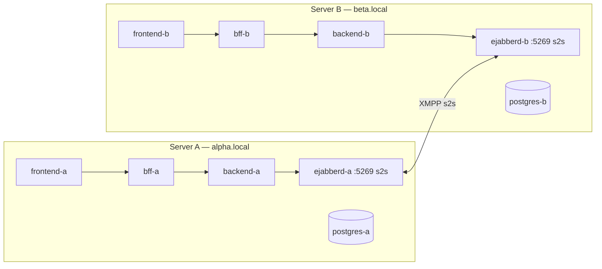
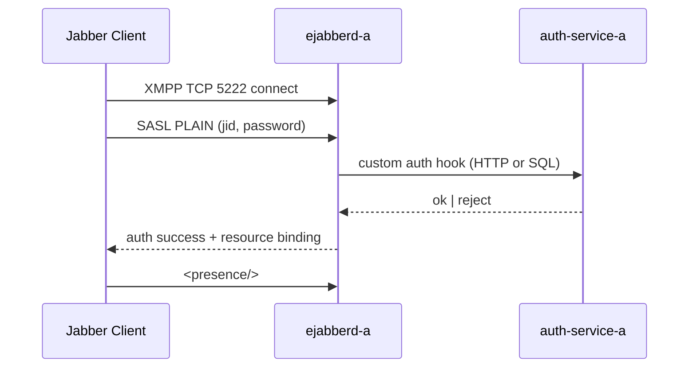
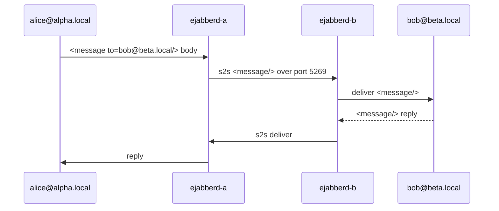
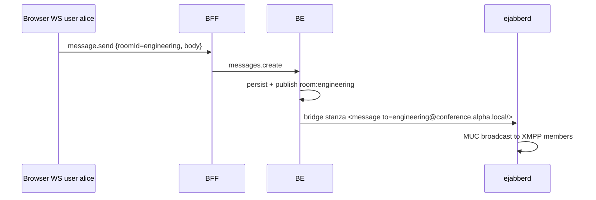
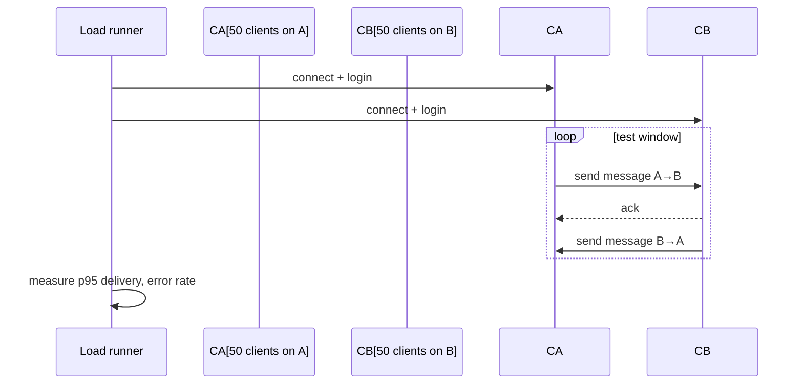

# Flow — EPIC-13 Jabber/XMPP Federation

> **DEFERRED POST-MVP.** EPIC-13 is not in the MVP cut. Diagrams below are architectural direction only; no wiring lands pre-launch. See spec 13-xmpp-federation.md for scope.

## Deployment topology (2 federated servers)



## XMPP client connection (external Jabber client)



## Cross-server message (A → B)



## Bridge from our WebSocket users to XMPP MUC



## Admin dashboards

```mermaid
flowchart LR
    ADMIN --> UI[/admin/connections]
    UI --> BFF_R[GET /admin/xmpp/connections]
    BFF_R --> BE
    BE --> EJ_API[ejabberd REST / mod_admin_extra]
    EJ_API --> LIST[active JIDs]
    ADMIN --> UI2[/admin/federation]
    UI2 --> STATS[/admin/xmpp/federation]
    STATS --> EJ_API
    EJ_API --> FSTAT[bytes/s per s2s link]
```

## Load test


