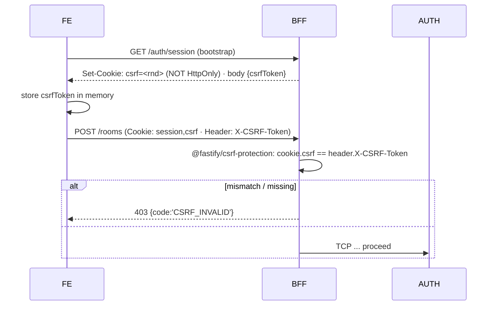
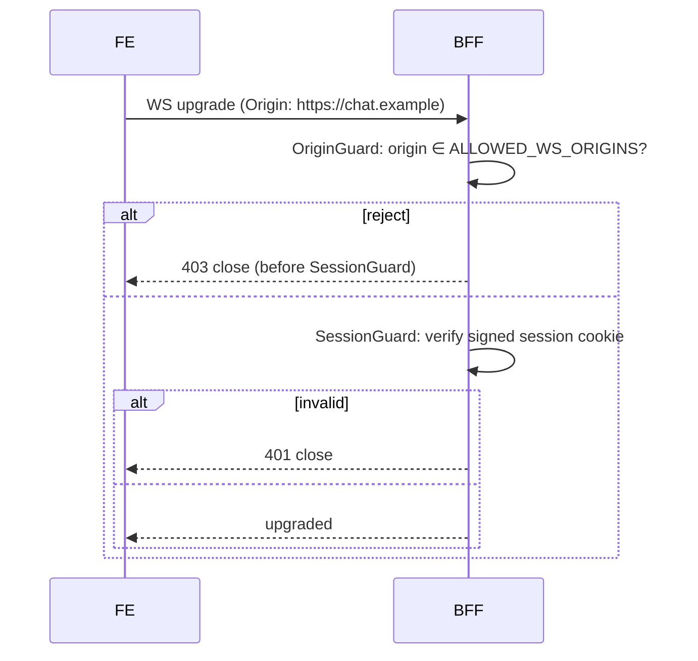
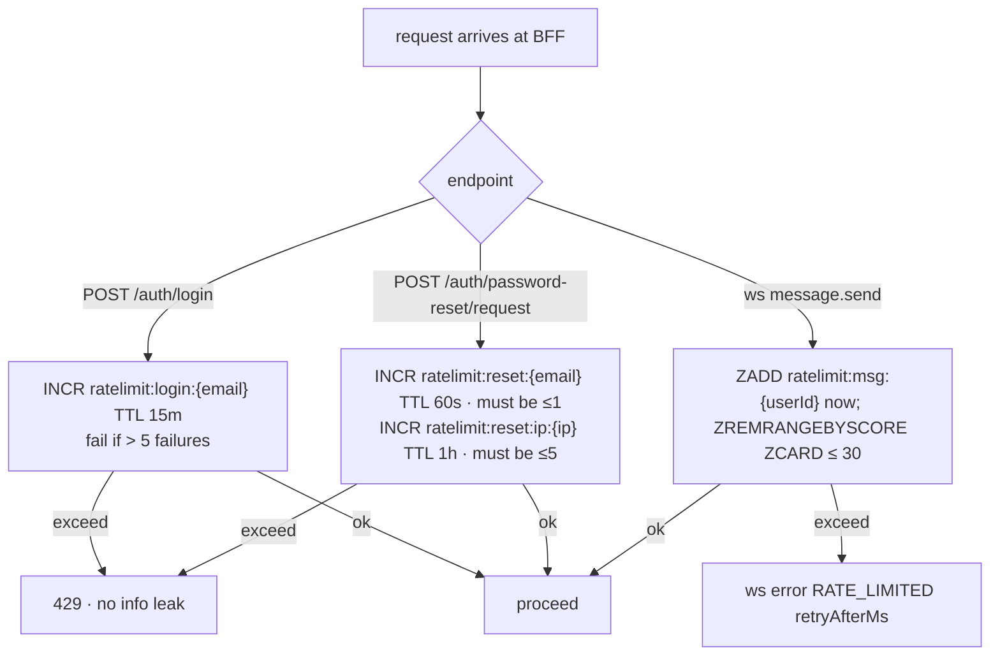
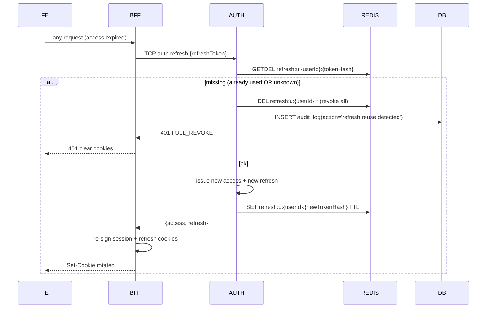
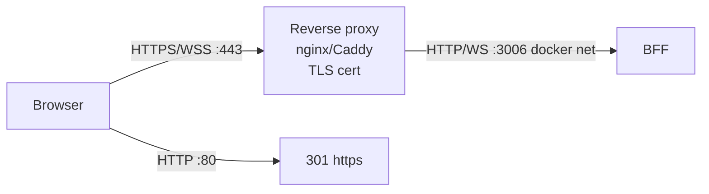

# Flow — EPIC-14 Security NFRs

Cross-cutting NFRs. Rate-limits live in Redis. CSRF at BFF REST. Origin check at WS handshake. Refresh rotation in Auth.

## CSRF double-submit on state-changing REST

## WS origin + SessionGuard

## Sliding-window rate-limits (login · reset · messaging)

Redis-outage fail-mode: login+reset fail-closed; messaging fail-open + log.

## Refresh token rotation + reuse detection

## TLS edge termination

HSTS · Secure cookies · `NODE_ENV=production`.

## Acceptance → artifact map

| AC | Diagram |
|---|---|
| AC-14-01 TLS | TLS edge termination |
| AC-14-02 CSRF | CSRF double-submit |
| AC-14-03 WS origin | WS origin + SessionGuard |
| AC-14-04 msg 30/5s | Sliding-window (messaging branch) |
| AC-14-05 reset 1/min · 5/hr | Sliding-window (reset branch) + flow/01 |
| AC-14-06 login 5/15m | Sliding-window (login branch) |
| AC-14-11 refresh single-use | Refresh rotation |
